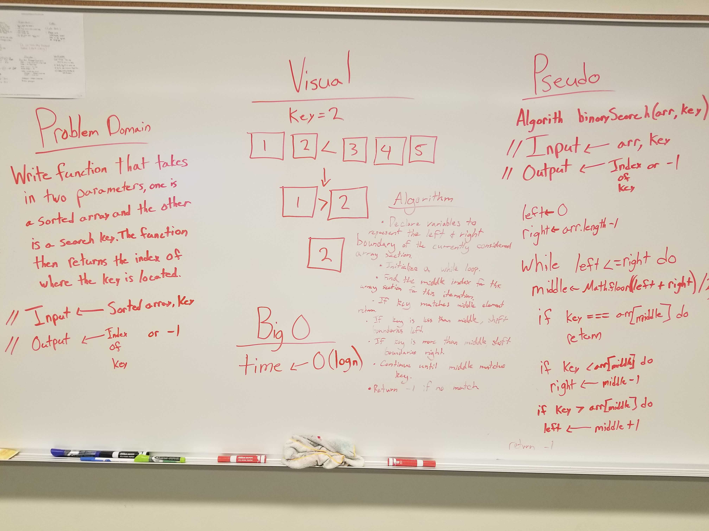
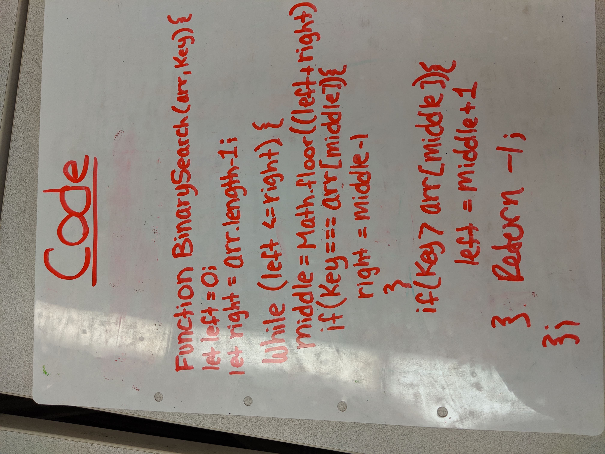

# Binary Search
Use Binary Search to find the index of the array value that matches the search key if it exists in the array

## Challenge
Write a function called BinarySearch which takes in 2 parameters: a sorted array and the search key. Without utilizing any of the built-in methods available to your language, return the index of the array’s element that is equal to the search key, or -1 if the element does not exist.

## Approach & Efficiency
First we want to get the mid point of the array and compare find if the value(key) number equals the middle point of the array. If the sorted array at middle index is less than the value, then shift to the left of the array and compare the middle index + 1. Repeat until the key is found. If the sorted array at middle of the index is less than declared value, then shift right and compare the middle index - 1. Repeat until the value is found. If the key does not exist in the array then return -1.

## Links and Resources
[Pull Request](https://github.com/nataliealway-401-advanced-javascript/data-structures-and-algorithms/pull/1)  
[Travis](https://www.travis-ci.com/nataliealway-401-advanced-javascript/data-structures-and-algorithms)

## Solution

