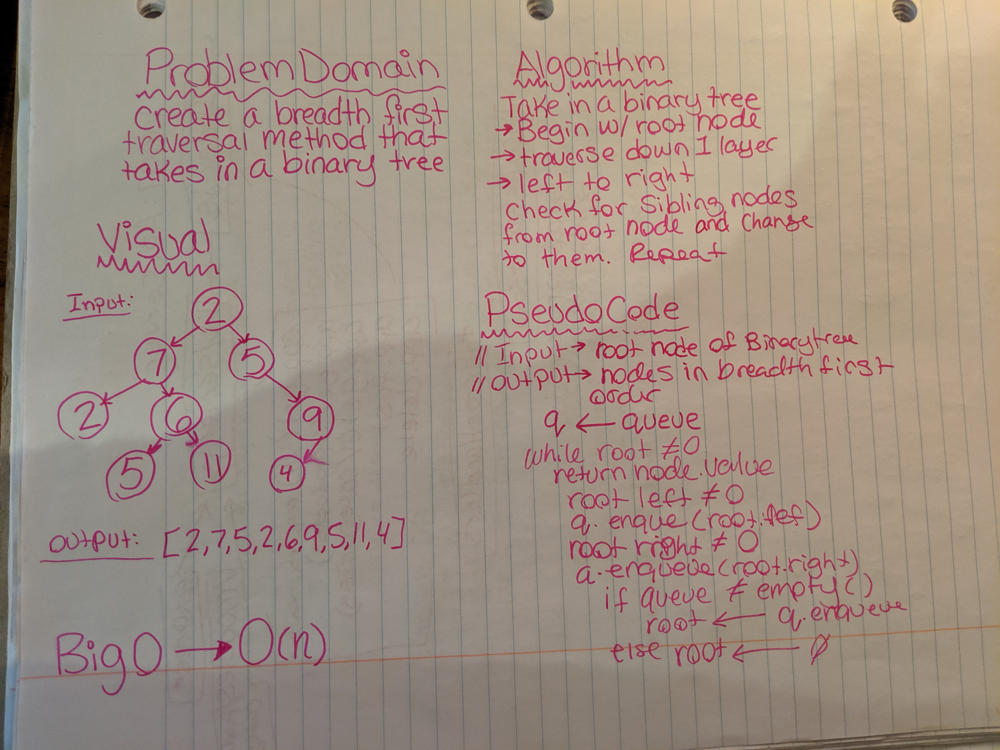

# Binary Trees - breadthFirst

## Challenge
Write a breadth first traversal method which takes a Binary Tree as its unique input

## Approach & Efficiency

## Links and Resources
[Pull Request]()  
[Travis]()  
[Jsdocs]()

## Solution
