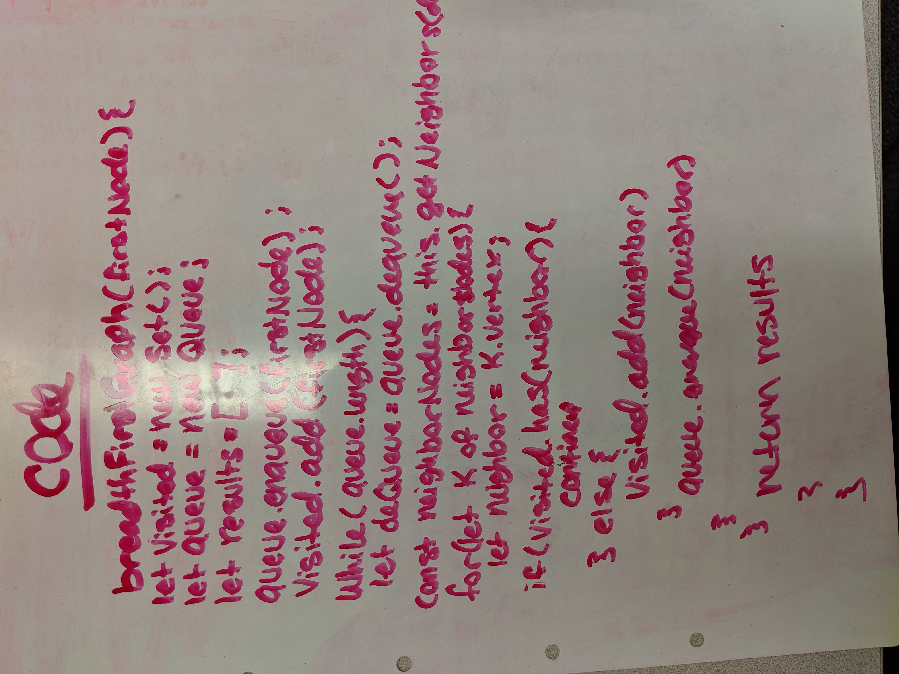

# Breadth-first Graphs
Implement a breadth-first traversal on a graph.
## Challenge
Extend your graph object with a breadth-first traversal method that accepts a starting node. Without utilizing any of the built-in methods available to your language, return a collection of nodes in the order they were visited. Display the collection.

## Links
[Submission PR]()  
[Travis CI](https://www.travis-ci.com/nataliealway-401-advanced-javascript/data-structures-and-algorithms) 
[Docs](https://github.com/nataliealway-401-advanced-javascript/data-structures-and-algorithms/blob/graph/docs/Graph.html)

## Approach & Efficiency
* Time -> O(n)

### Solution

