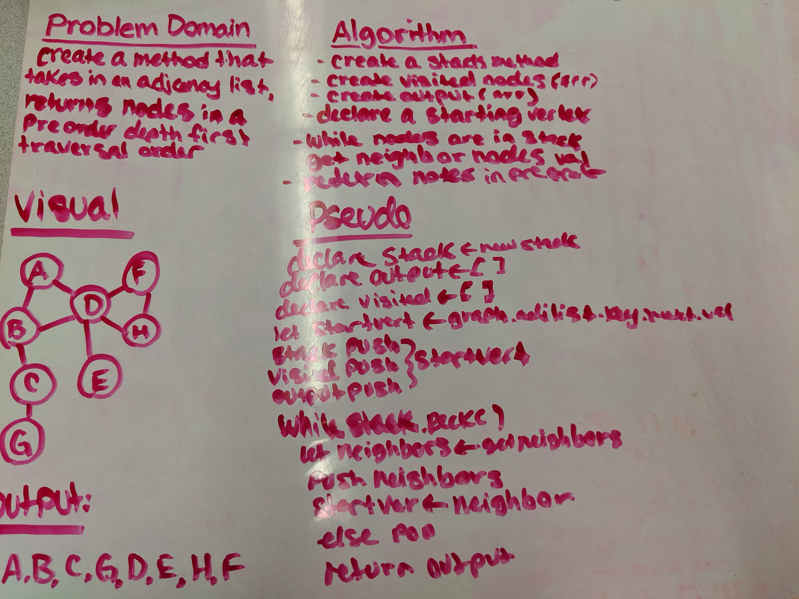
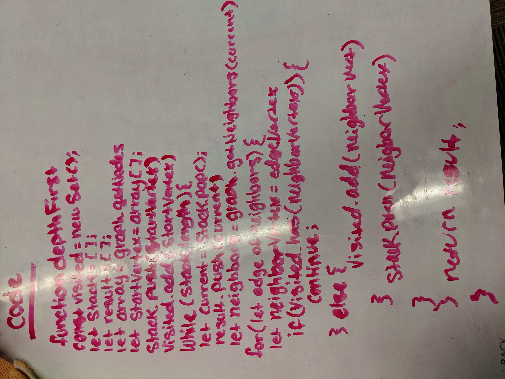

# Depth-first Graphs
Conduct a depth first preorder traversal on a graph
## Challenge
Create a function that accepts an adjacency list as a graph, and conducts a depth first traversal. Without utilizing any of the built-in methods available to your language, return a collection of nodes in their pre-order depth-first traversal order.

## Links
[Submission PR]()  
[Travis CI](https://www.travis-ci.com/nataliealway-401-advanced-javascript/data-structures-and-algorithms) 
[Docs](https://github.com/nataliealway-401-advanced-javascript/data-structures-and-algorithms/blob/graph/docs/Graph.html)

## Approach & Efficiency
* Time -> O(n)

### Solution

