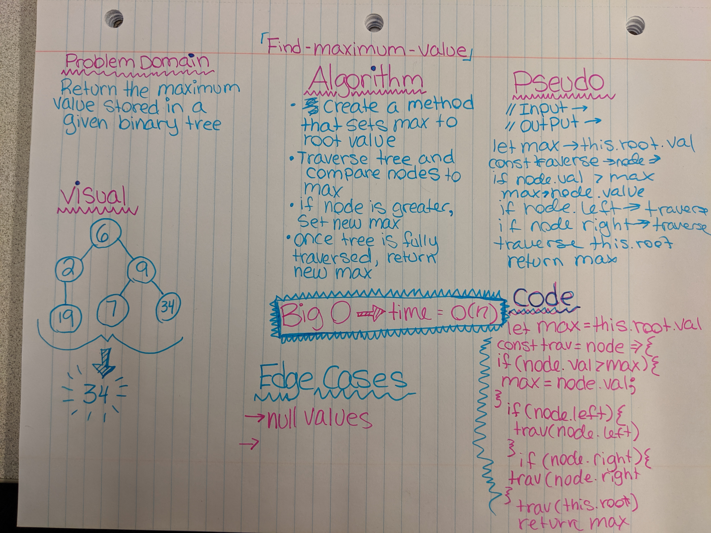

# Binary Trees: Find-Maximum-Value

Find the Maximum Value in a Binary Tree

## Challenge

Write an instance method called find-maximum-value. Without utilizing any of the built-in methods available to your language, return the maximum value stored in the tree. You can assume that the values stored in the Binary Tree will be numeric.

#### Links and Resources
[Submission PR]()  
[Travis-ci]()

#### Documentation
[jsdocs]()

## Approach & Efficiency

## Solution

