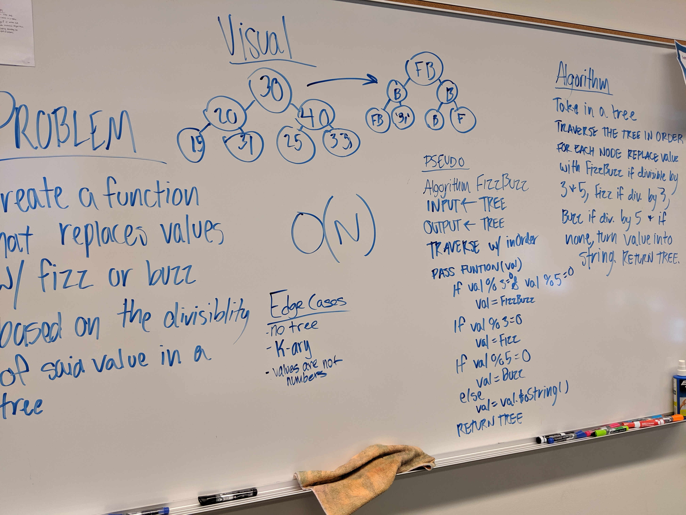

# Binary Trees - FizzBuzz

## Challenge
Conduct “FizzBuzz” on a tree while traversing through it. Change the values of each of the nodes dependent on the current node’s value

## Approach & Efficiency

## Links and Resources
[Pull Request](https://github.com/nataliealway-401-advanced-javascript/data-structures-and-algorithms/pull/16)  
[Travis](https://www.travis-ci.com/nataliealway-401-advanced-javascript/data-structures-and-algorithms)  
[Jsdocs](https://github.com/nataliealway-401-advanced-javascript/data-structures-and-algorithms/blob/fizzBuzz-tree/docs/challenges_fizzBuzzTree_fizzBuzzTree.js.html)

## Solution
