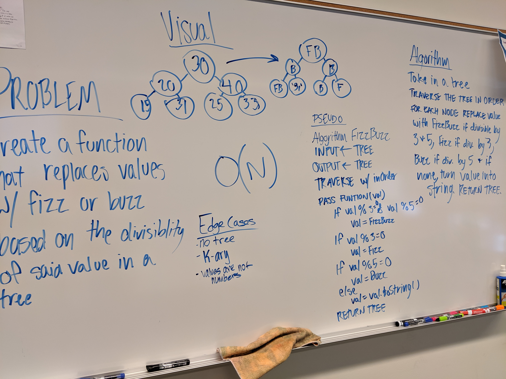

# Binary Trees - FizzBuzz

## Challenge
Conduct “FizzBuzz” on a tree while traversing through it. Change the values of each of the nodes dependent on the current node’s value

## Approach & Efficiency

## Links and Resources
[Pull Request]()  
[Travis]()  
[Jsdocs]()

## Solution
