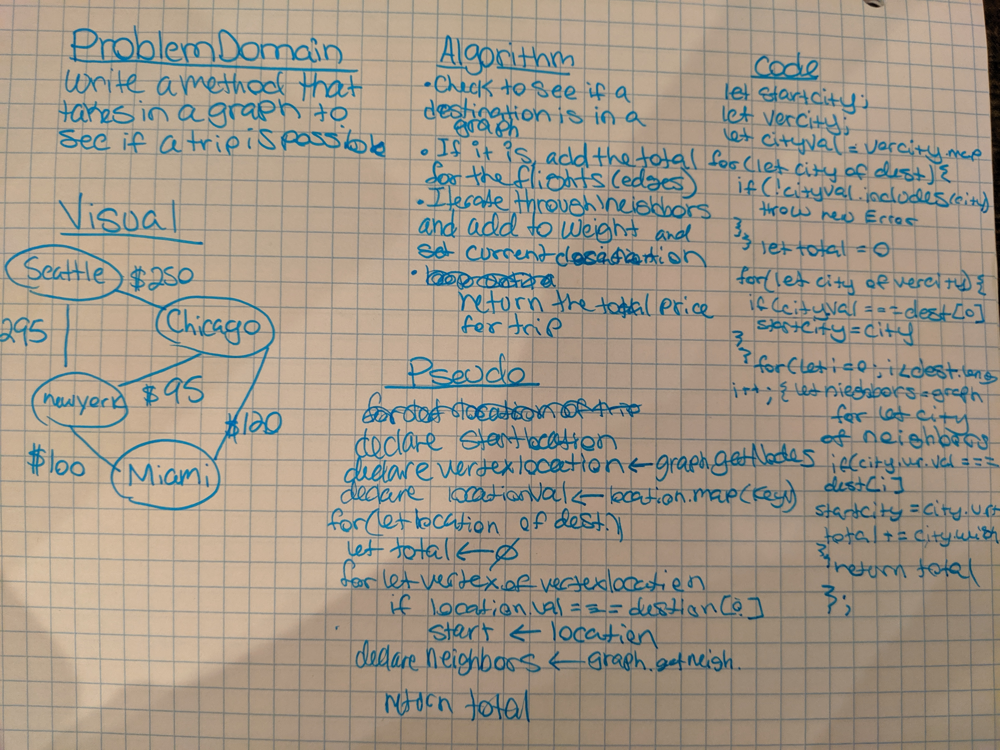

# Code Challenge: Find Edges
Given a business trip itinerary, and an Alaska Airlines route map, is the trip possible with direct flights? If so, how much will the total trip cost be?
## Challenge
Write a function based on the specifications above, which takes in a graph, and an array of city names. Without utilizing any of the built-in methods available to your language, return whether the full trip is possible with direct flights, and how much it would cost.
## Approach & Efficiency
getEdge -> 0(n^2)
## Links and Resources
[Submission PR](https://github.com/nataliealway-401-advanced-javascript/data-structures-and-algorithms/pull/27)  
[Travis Ci](https://www.travis-ci.com/nataliealway-401-advanced-javascript/data-structures-and-algorithms)  
[Docs](https://github.com/nataliealway-401-advanced-javascript/data-structures-and-algorithms/blob/get-edges/docs/Edge.html)

### Solution:

