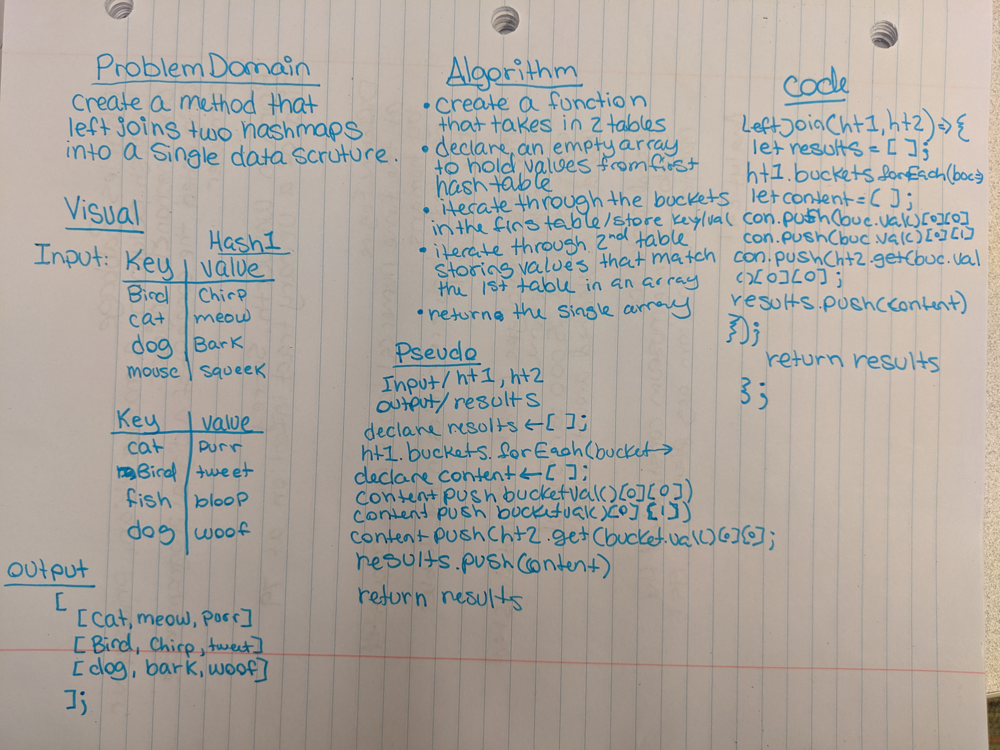

# Hashmap LEFT JOIN
Implement a simplified LEFT JOIN for 2 Hashmaps.

## Challenge
Write a function that LEFT JOINs two hashmaps into a single data structure.

## Approach & Efficiency
O(n) - Adding items into an array  
O(1) - Comparing the arrays

## Links and Resources
[submissionPR](https://github.com/nataliealway-401-advanced-javascript/data-structures-and-algorithms/pull/24)  
[Travis](https://www.travis-ci.com/nataliealway-401-advanced-javascript/data-structures-and-algorithms)  
[Docs]()  

## Solution

