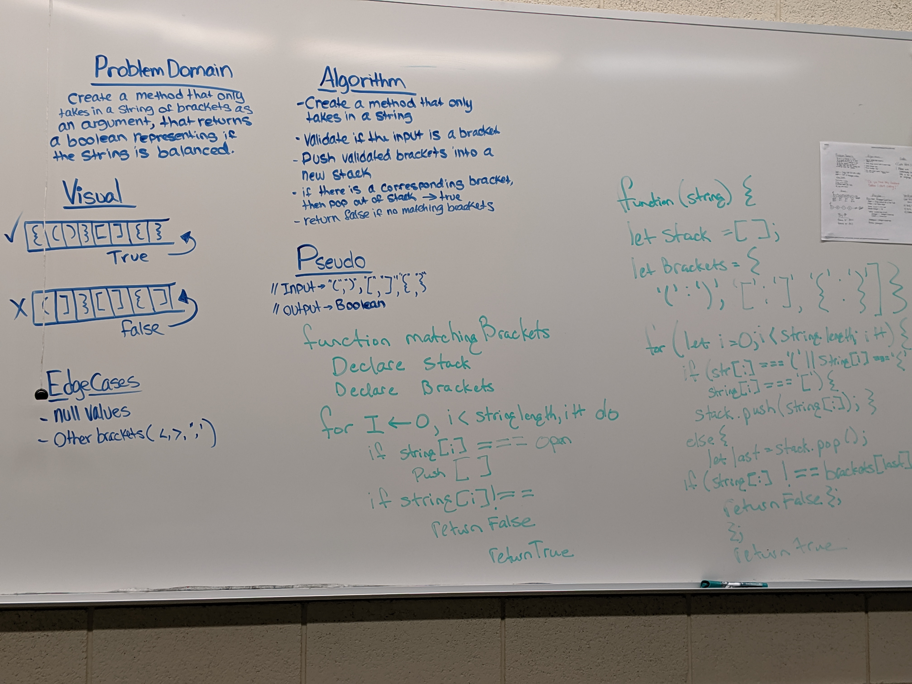

# Multi-bracket Validation

## Challenge
Create a method that takes in a string as its only argument, and should return a boolean representing whether or not the brackets in the string are balanced. 

## Approach & Efficiency
* First I brought in my stack methods to utilize in this challenge. First declare an object containing brackets in strings. Everytime a string is inputed, the function iterates through the string returning true if balanced and false if not.

* function multiBracketValidation -> O(n)

## Links and Resources
[Pull Request](https://github.com/nataliealway-401-advanced-javascript/data-structures-and-algorithms/pull/13)  
[Travis](https://www.travis-ci.com/nataliealway-401-advanced-javascript/data-structures-and-algorithms)  
[Jsdocs](https://github.com/nataliealway-401-advanced-javascript/data-structures-and-algorithms/blob/multi-bracket-validation/docs/challenges_multiBracketValidation_multi-bracket-validation.js.html)

## Solution

