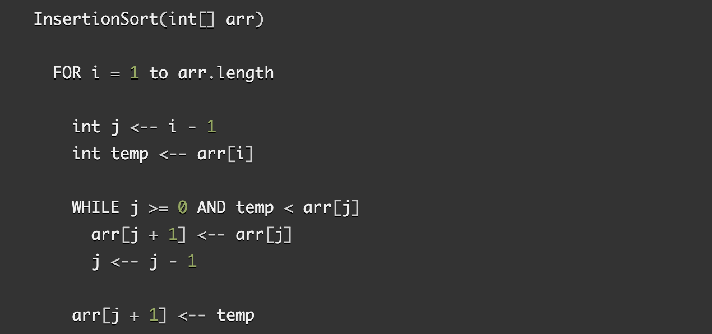

# Insertion Sort
Insertion sort is a simple sorting algorithm that builds the final sorted array (or list) one item at a time.

## Pseudocode

## Trace
Sample Array: [8,4,23,42,16,15]

* pass 1: In the first pass of our sample array, we loop through the index starting at 0, and because there is nothing to compare our first value to, it moves to the next position, which is index 1. Our code sees if 4 is smaller than 8, and because it is, it moves positions so that 4 is now at 0, and 8 is shifted to the position of index 1.
* pass 2: Our for loop continues to index 2, which has a value of 23, and compares itself to index 1, and then 0. Because it is not smaller than those values, it stays put, and the loop continues iterate through our array.
* pass 3: Position 3 holds the value of 42, it is not smaller then the numbers to its left, so it stays put.
* pass 4: At position 4 of our array holds the value of 16, we than see if 16 is smaller then 42 (yes) and then 23 (yes) and then 8 (NO!), 16 now will move to be at index position 2, which shifts the rest of the values over.
* pass 5: Our loop finally goes to position 5, which holds the value of 15, and does the same dance it did with the rest of our values, and lands at index position of 2
* Our array is sorted! Hooray!

## Efficency
* Time: O(n) - This algorithm will take as long as there are items in the array
* Space: O(1) -
No additional space is being created. This array is being sorted in place…keeping the space at constant O(1).

