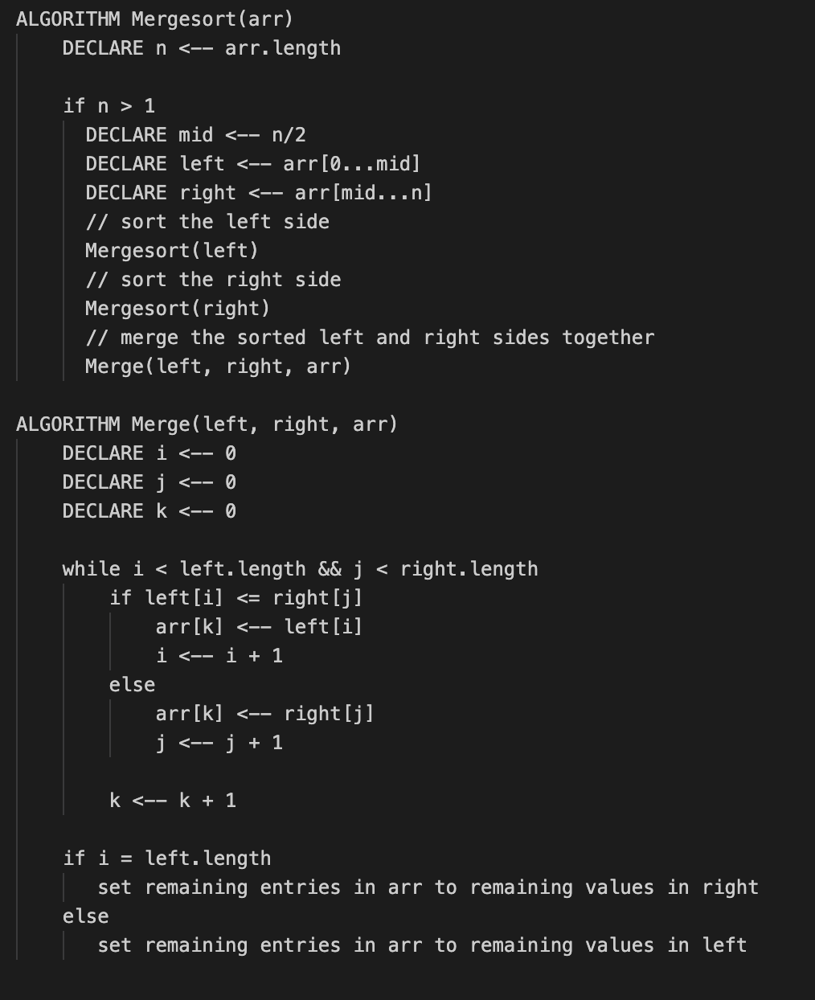
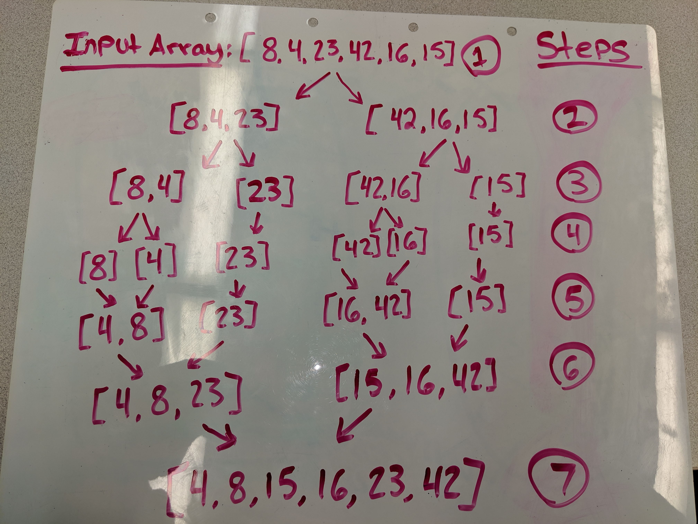

# Merge Sort
Merge sort is a divide-and-conquer algorithm based on the idea of breaking down a list into several sub-lists until each sublist consists of a single element and merging those sublists in a manner that results into a sorted lis

## Pseudo Code:

## Step Through:

* Step 1: Mergesort() splits the inputed array in half
* Step 2 - 4: Mergesort() continues spliting each array in half until the arrays can't be divided anymore.
* Step 5 - 6: Merge() then merges the divided arrays, comparing their values and positioning values from lowest to highest after each iteration of merging.
* Step 7: Returns the sorted merged array!

## Efficency
* **O(n)** - This algorithm will take as long as there are items within the array

## Solution
* [code](https://github.com/nataliealway-401-advanced-javascript/data-structures-and-algorithms/blob/mergeSort/challenges/sorting/mergeSort/mergeSort.js)
* [testing - Travis CI](https://www.travis-ci.com/nataliealway-401-advanced-javascript/data-structures-and-algorithms)

