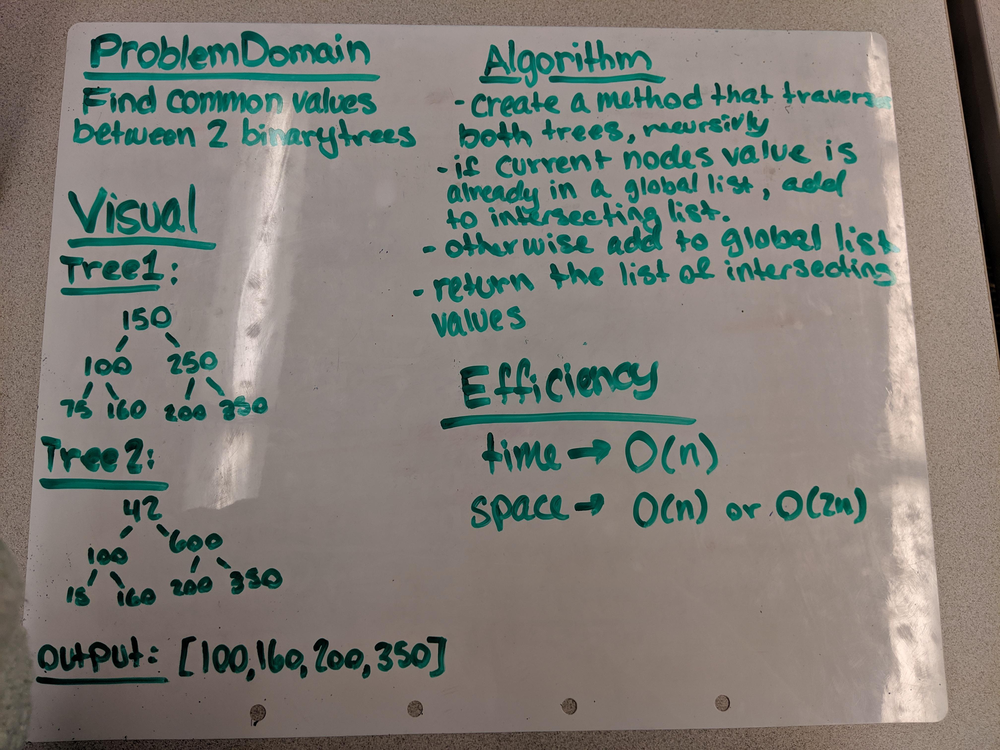
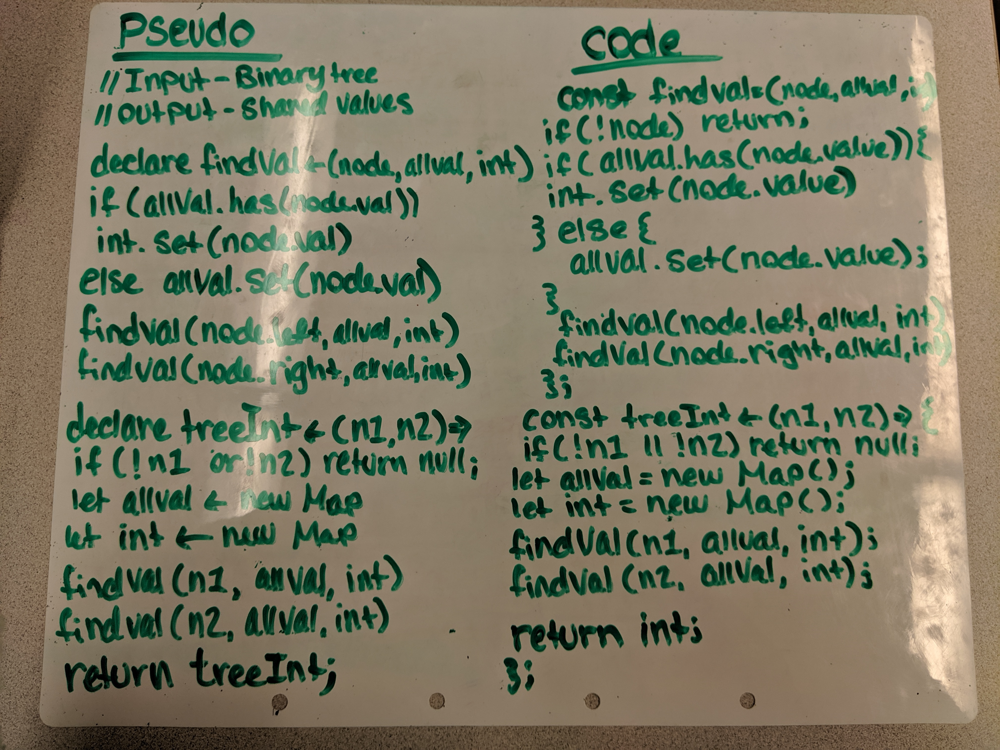

# Tree Intersection
## Challenge:
Given the root of two trees, find the intersection of values.

## Approach and Effiency 
My appraoch to this was to declare two variables: one for universal values and one for intersecting values. Then traverse both trees, one at a time, recursively. If the current node's value is already included in the universal list, add to intersecting list. Otherwise add to universal list. Then return the list of intersecting values.

## API
`Node`  
`findValues`  
`treeIntersection `

## Links and Resources
[submissionPR](https://github.com/nataliealway-401-advanced-javascript/data-structures-and-algorithms/pull/23)  
[Travis](https://www.travis-ci.com/nataliealway-401-advanced-javascript/data-structures-and-algorithms)  
[Docs](https://github.com/nataliealway-401-advanced-javascript/data-structures-and-algorithms/blob/tree-intersection/docs/challenges_treeIntersection_tree-intersection.js.html)  

## Solution

