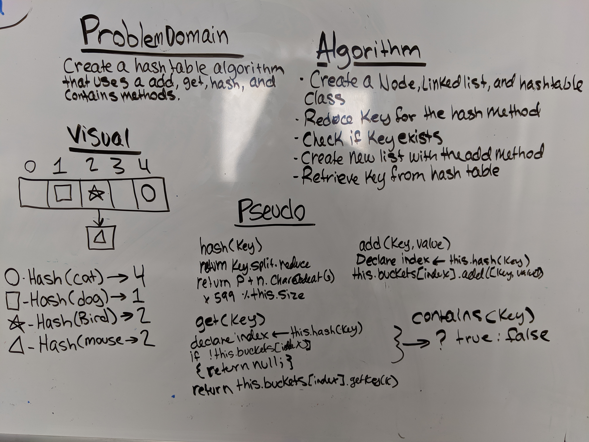

# Hash Table
Hash tables are used to map a given value with a particular key for faster access of elements.

## Challenge
Implement a Hashtable with the following methods:
* add: takes in both the key and value. This method should hash the key, and add the key and value pair to the table, handling collisions as needed.
* get: takes in the key and returns the value from the table.
* contains: takes in the key and returns a boolean, indicating if the key exists in the table already.
* hash: takes in an arbitrary key and returns an index in the collection.

## Efficiency: O(1), or in some cases O(n)

## API

### Linked List
* `add(value)`  
* `getKey(key)` 
* `values()`

### Hash Table
* `hash(key)`
* `add(key, value)`
* `get(key)`
* `contains(key)` 

## Links
* [submissionPR]()
* [travis]()
* [JSdocs]()

## UML

