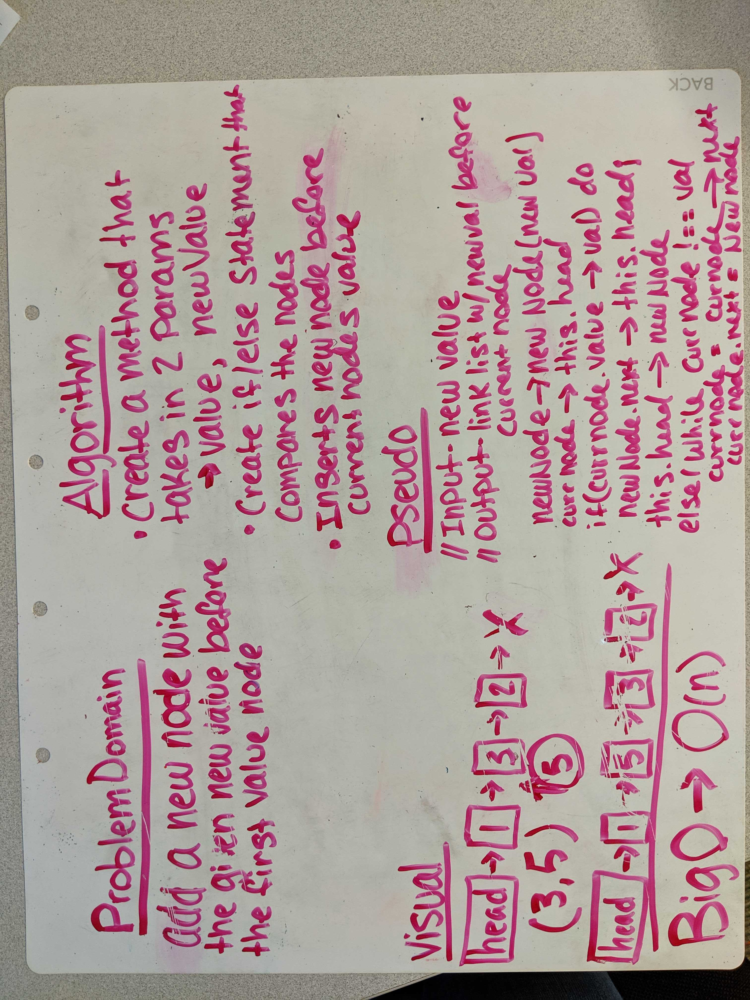

# Linked List Insertions

## Challenge
### Write the following methods for the Linked List class:

*append(value) which adds a new node with the given value to the end of the list
*insertBefore(value, newVal) which add a new node with the given newValue immediately before the first value node
*insertAfter(value, newVal) which add a new node with the given newValue immediately after the first value node

### BigO
O(n) - We dont go deeper then one iteration of the list

## Links and Resources
[Pull Request]()  
[Travis]()  
[Jsdocs]()

## Solution

