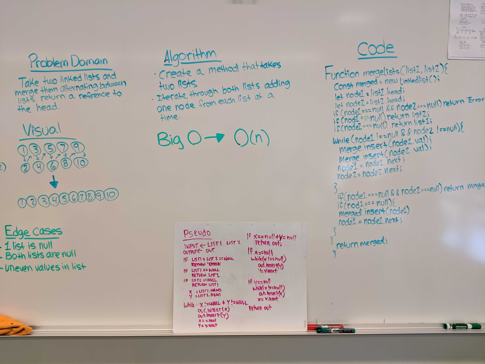

# Linked Lists - Kth From The End
Merge two linked lists into one

## Challenge
Write a function called mergeLists which takes two linked lists as arguments. Zip the two linked lists together into one so that the nodes alternate between the two lists and return a reference to the head of the zipped list. Try and keep additional space down to O(1). You have access to the Node class and all the properties on the Linked List class as well as the methods created in previous challenges.

## Approach & Efficiency
First we created if statements to rule out our edge cases. Then we created a method that takes in two linked lists, then iterates through those lists extracting the nodes and merging them together in a new list in an alternating pattern.

## Links and Resources
[Pull Request](https://github.com/nataliealway-401-advanced-javascript/data-structures-and-algorithms/pull/5)  
[Travis](https://www.travis-ci.com/nataliealway-401-advanced-javascript/data-structures-and-algorithms)  
[Jsdocs](https://github.com/nataliealway-401-advanced-javascript/data-structures-and-algorithms/tree/ll-kth-from-end/docs)

## Solution

