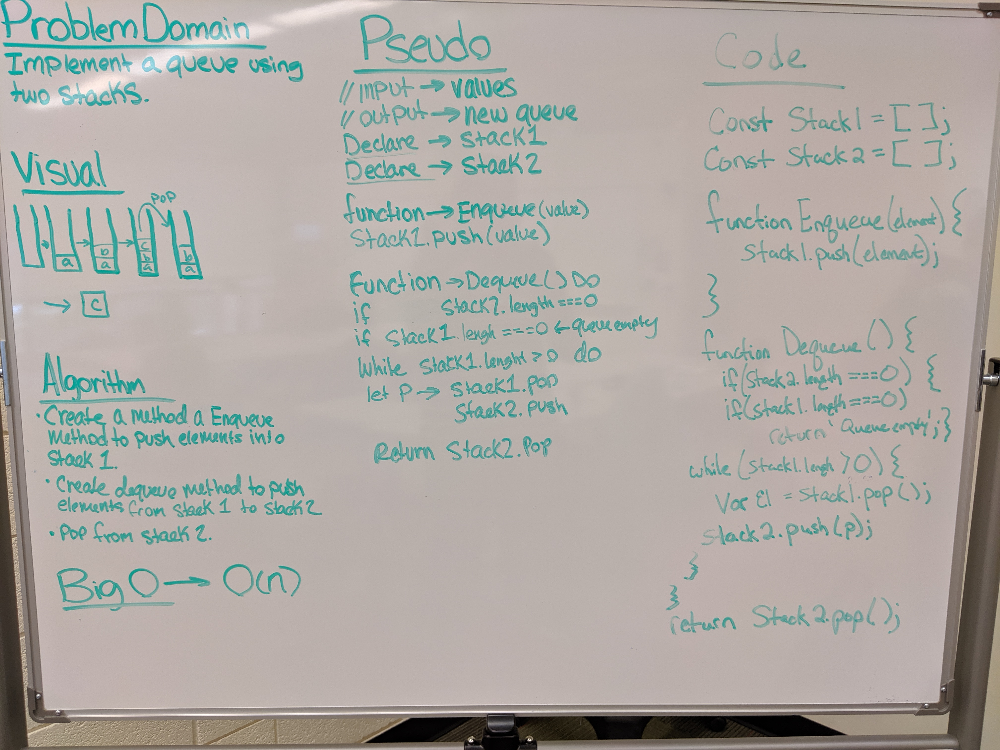

# Queue with Stacks
Implement a Queue using two Stacks.

## Challenge
Create a brand new PseudoQueue class. Do not use an existing Queue. Instead, this PseudoQueue class will implement our standard queue interface (the two methods listed below), but will internally only utilize 2 Stack objects. Ensure that you create your class with the following methods:

* enqueue(value) which inserts value into the PseudoQueue, using a first-in, first-out approach.
* dequeue() which extracts a value from the PseudoQueue, using a first-in, first-out approach.

## Approach & Efficiency
First we brought in the Stack methods and used those within the new PseudoQueue class, then established if the 2 stacks are empty, return 'empty queue', for enqueue method we created a simple insert() function, then while the top stack is not empty, "pop" for  the top of the stack and put in stack number 2 using the dequeue method.

* BigO -> O(n)

## Links and Resources
[Pull Request](https://github.com/nataliealway-401-advanced-javascript/data-structures-and-algorithms/pull/10)  
[Travis](https://www.travis-ci.com/nataliealway-401-advanced-javascript/data-structures-and-algorithms)  
[Jsdocs](https://github.com/nataliealway-401-advanced-javascript/data-structures-and-algorithms/blob/queue-with-stacks/docs/data-structures_queueWithStacks_queue-with-stacks.js.html)

## Solution

