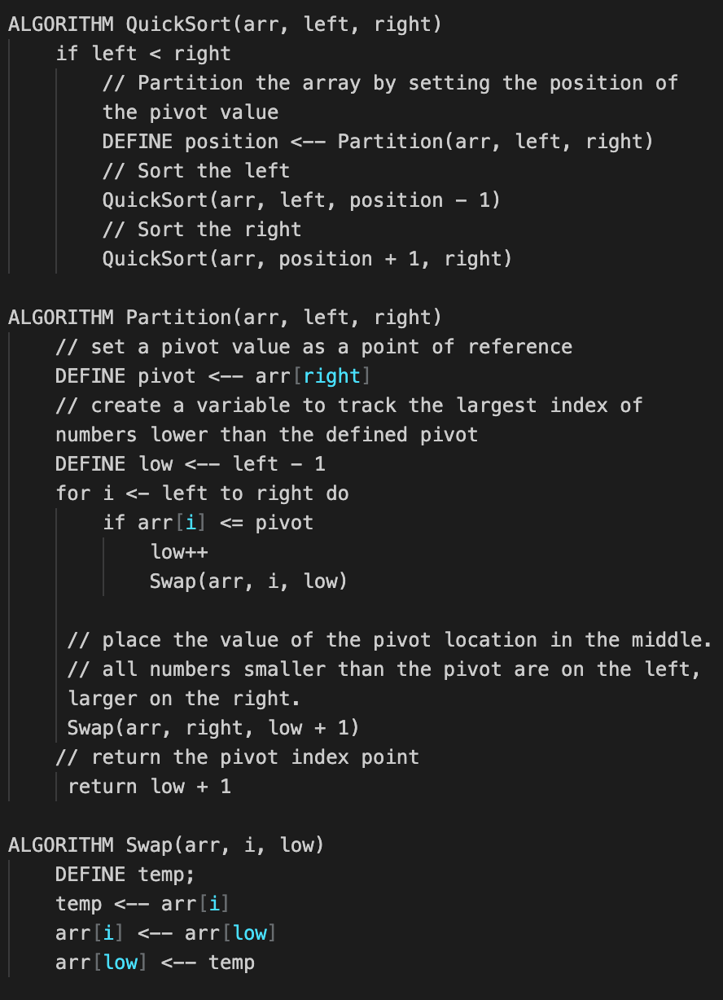

# Algorithms: Quick Sort
Like the merge sort algorithm, Quick sort is based on the divide-and-conquer approach based on the idea of choosing one element as a pivot element and partitioning the array around it such that: Left side of pivot contains all the elements that are less than the pivot element Right side contains all elements greater than the pivot

## Pseudo

## Step Through

* Partition the array by selecting the pivot value (23), and move the pivot to the end of the array.
* Move the left bound to the right until it reaches a value equal to or greater than the pivot
* Move the right bound to the left until it crosses the left bound or finds a value less than the pivot. (42)
* This pattern continous until the right side of the list sorted, then continous to sort the sublist or left side.

## Effiency 
* Best case: Ω(n log(n))
* Worst case: O(n^2)

## Solution
[code]()

