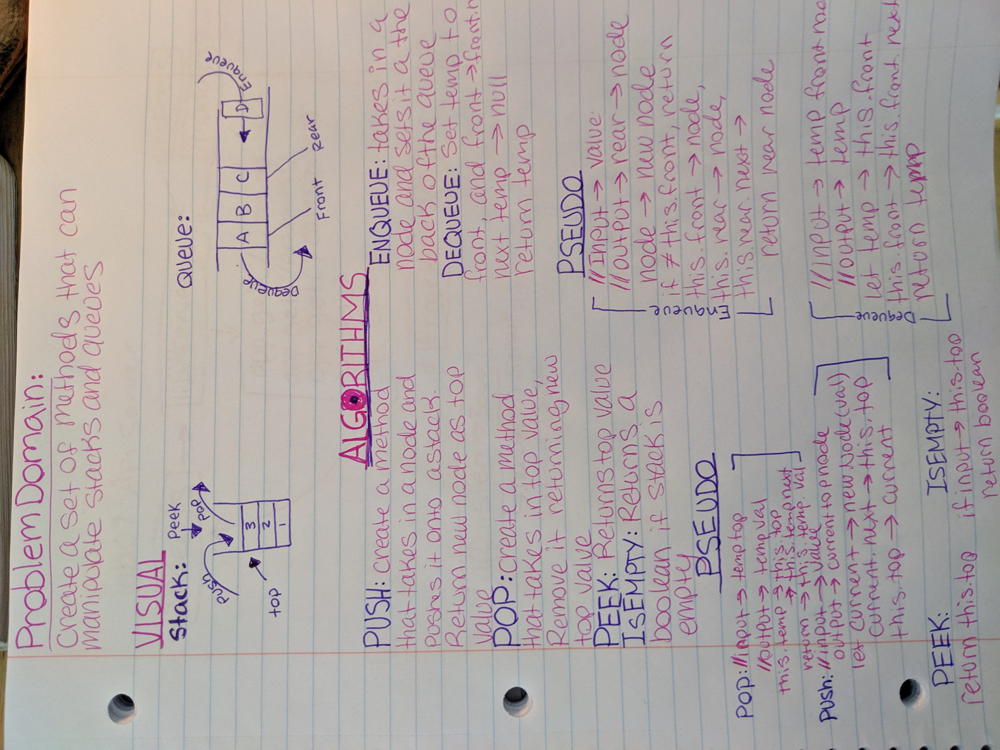

# Stacks and Queues
Implement a Stack and a Queue Data Structure

## Challenge
* Create a Stack class that has a top property and the following methods push, pop, and peek  

* Create a Queue class that has a front and rear property and the following methods enqueue, dequeue, and peek

## Approach & Efficiency
* I created a node, stack, and queue class. I focused on ensuring the efficency used within these classes had a O(1) complexitiy, and the methods themselves I believe are O(n)

*BigO -> O(n)

## Links and Resources
[Pull Request]()  
[Travis]()  
[Jsdocs]()

## Solution
